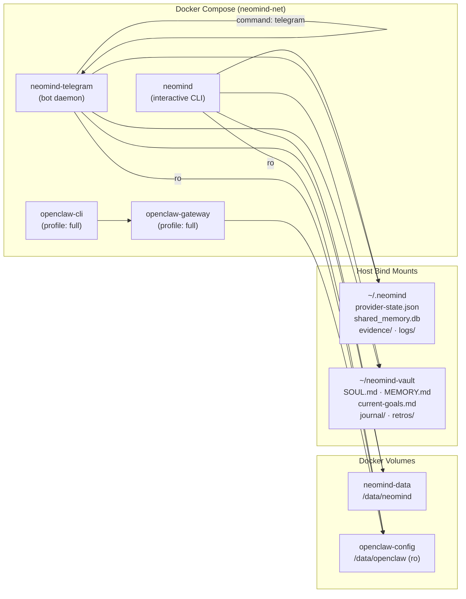
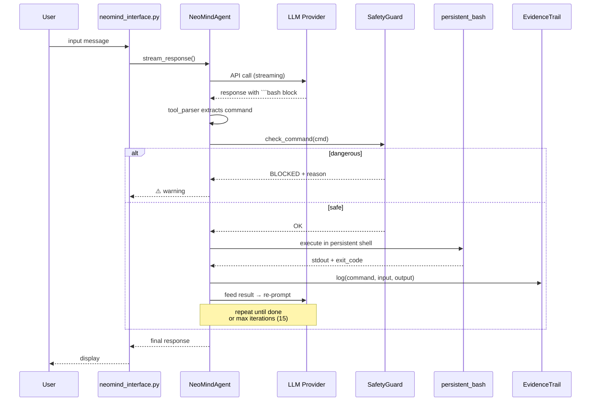
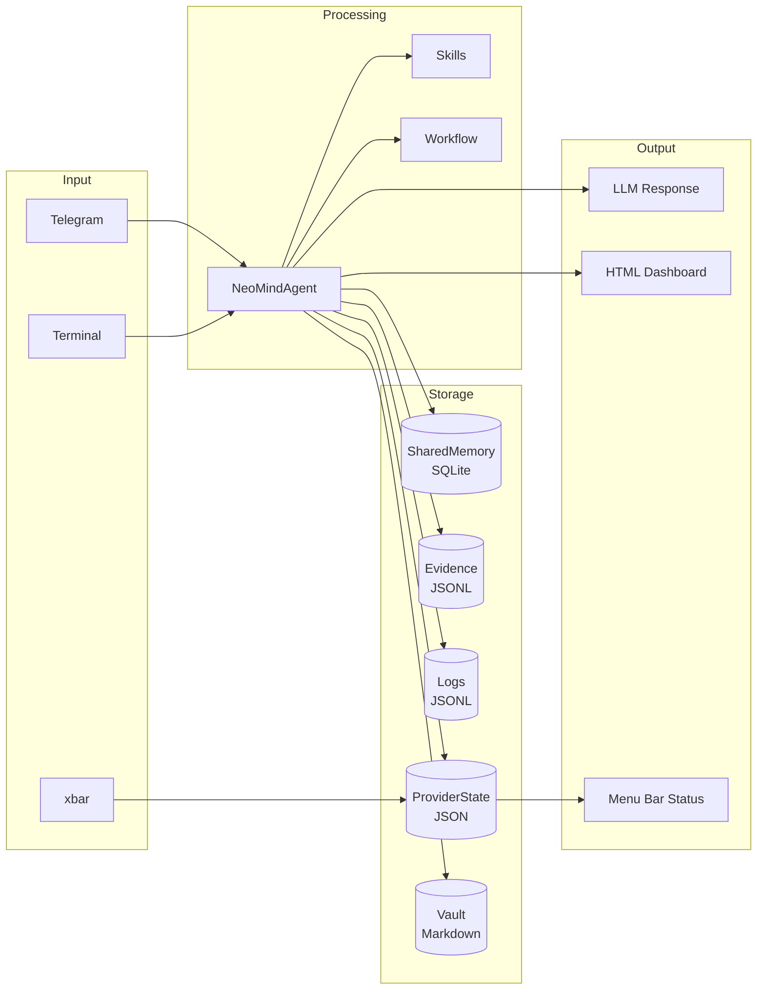

# neomind

A CLI coding agent powered by multiple LLM providers (DeepSeek, z.ai). Features an agentic tool loop, streaming responses, thinking mode, web search, and self-improvement capabilities.

## Features

- **Three Modes**: Chat (conversation), Coding (agent with tools), Finance (investment intelligence)
- **Multi-Provider Support**: Switch between DeepSeek and z.ai (GLM) models with `/switch`
- **Per-Model Specs**: Context window, output limits, and defaults auto-adjust per model
- **Agentic Tool Loop**: Model generates bash commands → agent executes → feeds results back → model continues
- **Telegram Bot**: Run as independent Telegram bot, collaborate with OpenClaw in the same group
- **Docker**: One-command deployment with OpenClaw integration
- **Streaming Chat**: Real-time streaming with thinking process visualization
- **Web Search**: `/search` command for DuckDuckGo integration
- **Code Analysis & Self-Iteration**: Analyze, improve, and safely modify the agent's own code
- **Permission Model**: Read-only tools auto-approve; write/execute tools ask for confirmation
- **Persistent Bash**: Shell state carries across commands (`cd`, `export`, env vars persist)
- **Obsidian Vault**: Markdown-based long-term memory (`~/neomind-vault`). NeoMind reads MEMORY.md + goals at startup, writes journal at session end. Browsable with Obsidian (free, Restricted Mode). Closes the self-improvement loop.

## Quick Start

```bash
# Clone and install
git clone <repository-url>
cd neomind
python3 -m venv .venv --system-site-packages
source .venv/bin/activate
pip install -e .

# Set up API keys
cp .env.example .env
# Edit .env — add your DEEPSEEK_API_KEY and/or ZAI_API_KEY

# Run
python3 main.py
```

## Configuration

### Environment Variables (`.env`)

```env
DEEPSEEK_API_KEY=your_deepseek_api_key_here
ZAI_API_KEY=your_zai_api_key_here
```

At least one provider key is required. Get keys from:
- DeepSeek: https://platform.deepseek.com/api_keys
- z.ai: https://open.z.ai

### Config Files

```
agent/config/
  base.yaml     # Shared: model, temperature, max_tokens, stream, timeout
  chat.yaml     # Chat mode: system prompt, auto-search triggers
  coding.yaml   # Coding mode: system prompt with tool instructions
```

Default model is `deepseek-chat`. Change with `/switch <model>` or edit `base.yaml`.

### Supported Models

| Model | Provider | Context | Max Output | Default |
|-------|----------|---------|------------|---------|
| deepseek-chat | DeepSeek | 128K | 8K | 8K |
| deepseek-coder | DeepSeek | 128K | 8K | 8K |
| deepseek-reasoner | DeepSeek | 128K | 64K | 16K |
| glm-5 | z.ai | 205K | 128K | 16K |
| glm-4.7 | z.ai | 200K | 32K | 8K |
| glm-4.7-flash | z.ai | 200K | 32K | 8K |
| glm-4.5 | z.ai | 128K | 16K | 8K |
| glm-4.5-flash | z.ai | 128K | 16K | 4K |

Limits auto-adjust when switching models. Run `/models` to see all available models with their specs.

## Commands

### Core

| Command | Description |
|---------|-------------|
| `/switch <model>` | Switch model (e.g., `/switch glm-5`) |
| `/models` | Show all available models with specs |
| `/think` | Toggle thinking mode |
| `/search <query>` | Web search via DuckDuckGo |
| `/clear` | Clear conversation history |
| `/history` | Show conversation history |
| `/debug` | Toggle verbose debug output |
| `/permissions [auto\|normal\|plan]` | Set permission mode |
| `/quit` | Exit |

### Coding Mode

| Command | Description |
|---------|-------------|
| `/run <cmd>` | Execute shell command in persistent bash |
| `/grep <pattern> [path]` | Search text across files (uses ripgrep if available) |
| `/find <pattern> [path]` | Find files matching pattern |
| `/read <file>` | Read and display a file |
| `/code scan [path]` | Scan a codebase for analysis |
| `/code reason <file>` | Deep analysis using reasoning model |
| `/code self-improve` | Suggest improvements to agent's own code |
| `/transcript` | Show full conversation transcript |
| `/expand [n]` | Show thinking content from turn N |

### Model Management

| Command | Description |
|---------|-------------|
| `/models` | List all models from all providers |
| `/models list --refresh` | Force refresh model list from API |
| `/models switch <model>` | Switch model (same as `/switch`) |
| `/models current` | Show current model + provider + specs |

## Architecture

### System Overview

```mermaid
graph TB
    subgraph Entry["Entry Points"]
        CLI["main.py<br/>(CLI)"]
        TG["agent/finance/telegram_bot.py<br/>(Telegram Bot)"]
        XBAR["llm-gateway.1m.sh<br/>(xbar Menu Bar)"]
    end

    subgraph UI["User Interfaces"]
        CLUI["cli/neomind_interface.py<br/>Terminal UI + Agentic Loop"]
        TGAPI["Telegram API<br/>polling + /commands"]
    end

    CLI --> CLUI
    TG --> TGAPI

    subgraph Core["Agent Core (agent/core.py — NeoMindAgent)"]
        PROV["Provider Registry<br/>DeepSeek · z.ai · LiteLLM"]
        STREAM["Streaming Engine<br/>+ Thinking Mode"]
        CMD["Command Dispatcher<br/>40+ commands"]
        SPEC["Model Spec Engine<br/>context/output limits"]
    end

    CLUI --> Core
    TGAPI --> Core

    subgraph Modes["Three Personalities"]
        CHAT["Chat 💬<br/>chat.yaml<br/>Daily conversation"]
        CODE["Coding 🔧<br/>coding.yaml<br/>Agentic dev assistant"]
        FIN["Finance 📈<br/>fin.yaml<br/>Investment intelligence"]
    end

    Core --> Modes

    subgraph Tools["Tool System"]
        TP["tool_parser.py<br/>bash/python extraction"]
        TL["tools.py<br/>read · write · edit · glob · grep"]
        PB["persistent_bash.py<br/>stateful shell session"]
        CE["command_executor.py<br/>safe execution"]
    end

    CODE --> Tools

    subgraph Skills["Skill System (19 active + 4 deprecated)"]
        SL["skills/loader.py<br/>YAML frontmatter + MD body"]
        SS["Shared (9):<br/>audit · autoplan · browse · careful<br/>digest · investigate · neomind-upgrade · retro · teach"]
        SC["Chat (2): memo · office-hours"]
        SK["Coding (4): eng-review · perf · qa · ship"]
        SF["Finance (4): backtest · qa-trading · risk · trade-review"]
    end

    Core --> SL
    SL --> SS & SC & SK & SF

    subgraph Workflow["Workflow Engine (agent/workflow/)"]
        SPR["sprint.py<br/>Think→Plan→Build→Review→Test→Ship→Reflect"]
        GRD["guards.py<br/>/careful · /freeze · /guard<br/>regex pattern detection"]
        EVI["evidence.py<br/>append-only audit.jsonl"]
        REV["review.py<br/>mode-aware review dispatch"]
    end

    Core --> Workflow

    subgraph Evolution["Self-Evolution (agent/evolution/)"]
        AE["auto_evolve.py<br/>startup health · daily audit · weekly retro<br/>learn from feedback & patterns"]
        UPG["upgrade.py<br/>git-based update + rollback"]
    end

    Core --> Evolution

    subgraph Memory["Persistent Memory"]
        SM["shared_memory.py<br/>SQLite WAL · cross-mode<br/>preferences · facts · patterns · feedback"]
        SEC["secure_memory.py<br/>encrypted SQLite (finance)"]
    end

    subgraph Vault["Obsidian Vault (agent/vault/)"]
        VR["reader.py<br/>MEMORY.md + goals + journal<br/>→ system prompt injection"]
        VW["writer.py<br/>YAML frontmatter journals<br/>goals · retros · learnings"]
        VP["promoter.py<br/>3-occurrence threshold<br/>SharedMemory → MEMORY.md"]
        VC2["_config.py<br/>env → Docker → local"]
    end

    Modes --> SM
    FIN --> SEC
    Core --> VR
    Core --> VW
    Evolution --> VW
    Evolution --> VP
    SM --> VP

    subgraph Logging["Unified Logging (agent/logging/)"]
        UL["unified_logger.py<br/>daily JSONL rotation<br/>llm_call · command · file_op · error"]
        PII["pii_sanitizer.py<br/>phone · email · SSN · API keys"]
    end

    UL --> PII
    Core --> UL

    subgraph Finance["Finance Module (agent/finance/)"]
        HS["hybrid_search.py<br/>6-layer search engine<br/>DDG · Google RSS · TF-IDF · RRF"]
        DH["data_hub.py<br/>yfinance · AKShare · CoinGecko · Finnhub"]
        ND["news_digest.py<br/>conflict detection · multi-source"]
        QE["quant_engine.py<br/>BS · DCF · VaR · compound"]
        DB["dashboard.py<br/>HTML Chart.js KPI dashboard"]
        SR["source_registry.py<br/>Bayesian trust scoring"]
        RSS["rss_feeds.py<br/>EN+ZH RSS manager"]
        PS["provider_state.py<br/>bidirectional sync xbar↔Docker"]
        DG["diagram_gen.py · chat_store.py · hackernews.py"]
    end

    FIN --> Finance

    subgraph OClaw["OpenClaw Integration"]
        OG["openclaw_gateway.py<br/>WebSocket client"]
        OS["openclaw_skill.py"]
        MB["memory_bridge.py<br/>SQLite↔Markdown sync"]
        MS["mobile_sync.py"]
    end

    Finance --> OClaw

    subgraph Analysis["Code Intelligence"]
        CA["code_analyzer.py"]
        SI["self_iteration.py"]
        PL["planner.py · GoalPlanner"]
        NL["natural_language.py"]
        CM["context_manager.py<br/>token counting + compression"]
        WM["workspace_manager.py"]
        SRC["search.py<br/>DuckDuckGo"]
    end

    Core --> Analysis

    subgraph Sync["Bidirectional Provider Sync"]
        PSJ["~/.neomind/provider-state.json"]
    end

    PS --> PSJ
    XBAR --> PSJ

    subgraph DataStores["Data Stores"]
        SMDB["~/.neomind/shared_memory.db<br/>(SQLite WAL)"]
        AUDITL["~/.neomind/evidence/audit.jsonl<br/>(append-only)"]
        LOGSJ["~/.neomind/logs/YYYY-MM-DD.jsonl<br/>(daily rotation)"]
        SECDB["~/.neomind/finance/memory.db<br/>(encrypted SQLite)"]
        USAGEJ["~/.llm-gateway/usage-daily.json<br/>(incremental tracker)"]
        VAULT["~/neomind-vault/<br/>MEMORY.md · SOUL.md<br/>journal/ · retros/<br/>(Obsidian-browsable)"]
    end

    SM --> SMDB
    EVI --> AUDITL
    UL --> LOGSJ
    SEC --> SECDB
    XBAR --> USAGEJ
    VW --> VAULT
    VR --> VAULT

    subgraph External["External Services"]
        DS["DeepSeek API"]
        ZAI["z.ai (GLM) API"]
        LLM["LiteLLM (local)<br/>Ollama proxy"]
        DDG["DuckDuckGo"]
        GNEWS["Google News RSS"]
        YF["yfinance · AKShare"]
        CG["CoinGecko"]
        FH["Finnhub"]
        TGSERV["Telegram Bot API"]
        OCSERV["OpenClaw Gateway"]
    end

    PROV --> DS & ZAI & LLM
    HS --> DDG & GNEWS
    DH --> YF & CG & FH
    TGAPI --> TGSERV
    OG --> OCSERV
```



### Docker Deployment Topology



### Agentic Tool Loop (Coding Mode)



### Data Flow Summary



### Key Files

```
NeoMind_agent/
├── main.py                          # Entry point (--mode chat|coding|fin)
├── agent_config.py                  # YAML config loader
├── agent/
│   ├── core.py                      # NeoMindAgent: providers, streaming, commands, tool loop
│   ├── tool_parser.py               # Extracts bash/python blocks from LLM output
│   ├── tools.py                     # Tool implementations (read, write, edit, glob, grep)
│   ├── tool_schema.py               # Typed tool definitions + parameter validation
│   ├── persistent_bash.py           # Stateful shell session across commands
│   ├── context_manager.py           # Token counting, compression, context window mgmt
│   ├── search.py                    # DuckDuckGo web search
│   ├── safety.py                    # Path validation, file backup, audit log
│   ├── planner.py                   # Goal planner + change planning
│   ├── code_analyzer.py             # Codebase analysis
│   ├── self_iteration.py            # Self-improvement engine
│   ├── natural_language.py          # NL intent interpreter
│   ├── command_executor.py          # Safe command execution
│   ├── workspace_manager.py         # Workspace boundary mgmt
│   ├── formatter.py                 # Output formatting helpers
│   ├── help_system.py               # /help command tree
│   ├── task_manager.py              # Task tracking
│   ├── config/
│   │   ├── base.yaml                # Shared: model, temperature, max_tokens
│   │   ├── chat.yaml                # Chat personality: system prompt + behavior
│   │   ├── coding.yaml              # Coding personality: tool instructions
│   │   └── fin.yaml                 # Finance personality: investment focus
│   ├── skills/
│   │   ├── loader.py                # SKILL.md parser + registry
│   │   ├── shared/                  # 9 active: audit, autoplan, browse, careful,
│   │   │                            #   digest, investigate, neomind-upgrade, retro, teach
│   │   ├── chat/                    # 2 skills: memo, office-hours
│   │   ├── coding/                  # 4 skills: eng-review, perf, qa, ship
│   │   └── fin/                     # 4 skills: backtest, qa-trading, risk, trade-review
│   ├── workflow/
│   │   ├── sprint.py                # 7-phase execution framework
│   │   ├── guards.py                # /careful /freeze /guard — regex danger detection
│   │   ├── evidence.py              # Append-only audit trail (JSONL)
│   │   ├── review.py                # Mode-aware self-review dispatch
│   │   └── audit.py                 # Self-audit engine (iterative search→check→fix→verify)
│   ├── evolution/
│   │   ├── auto_evolve.py           # Startup health, daily audit, weekly retro
│   │   └── upgrade.py               # Git-based update with rollback
│   ├── vault/
│   │   ├── __init__.py              # Package exports (graceful degradation)
│   │   ├── _config.py               # Vault dir resolution (env → Docker → local)
│   │   ├── reader.py                # VaultReader: MEMORY.md + goals + journal → system prompt
│   │   ├── writer.py                # VaultWriter: journals, goals, retros, memory entries
│   │   └── promoter.py              # 3-occurrence pattern promotion: SharedMemory → MEMORY.md
│   ├── memory/
│   │   └── shared_memory.py         # Cross-mode SQLite (preferences/facts/patterns/feedback)
│   ├── logging/
│   │   ├── unified_logger.py        # Daily JSONL rotation, 6 log types
│   │   └── pii_sanitizer.py         # Auto-redact PII before logging
│   ├── finance/
│   │   ├── hybrid_search.py         # 6-layer search (DDG, Google RSS, TF-IDF, RRF)
│   │   ├── data_hub.py              # Market data (yfinance/AKShare/CoinGecko/Finnhub)
│   │   ├── secure_memory.py         # Encrypted SQLite for finance data
│   │   ├── news_digest.py           # Multi-source news + conflict detection
│   │   ├── quant_engine.py          # Black-Scholes, DCF, VaR, compound
│   │   ├── dashboard.py             # HTML Chart.js dashboard generator
│   │   ├── source_registry.py       # Bayesian trust scoring
│   │   ├── rss_feeds.py             # EN+ZH RSS feed manager
│   │   ├── telegram_bot.py          # Telegram bot adapter + provider sync
│   │   ├── provider_state.py        # Bidirectional xbar↔Docker provider sync
│   │   ├── usage_tracker.py         # Incremental log-based usage stats
│   │   ├── chat_store.py            # Conversation persistence
│   │   ├── hackernews.py            # HN integration
│   │   ├── diagram_gen.py           # Mermaid diagram generator
│   │   ├── agent_collab.py          # Inter-agent collaboration protocol
│   │   ├── openclaw_gateway.py      # OpenClaw WebSocket client
│   │   ├── openclaw_skill.py        # OpenClaw skill adapter
│   │   ├── memory_bridge.py         # SQLite↔Markdown sync with OpenClaw
│   │   └── mobile_sync.py           # Unified sync gateway
│   └── browser/
│       └── daemon.py                # Browser automation daemon
├── cli/
│   └── neomind_interface.py         # Terminal UI, agentic loop, content filter
├── tests/                           # 1479 tests (including 51 vault tests)
├── plans/                           # Architecture decisions and implementation plans
├── Dockerfile                       # Multi-stage Docker build
├── docker-compose.yml               # CLI + Telegram + OpenClaw (4 services)
├── docker-compose.connect.yml       # Connect to existing OpenClaw
├── docker-entrypoint.sh             # Container entrypoint
└── update.sh                        # Pull + rebuild + restart script
```

## Tool System

The agent uses a **bash-centric** approach for tool execution in coding mode. The system prompt instructs the model to use ` ```bash ` code blocks for all operations:

```
cat -n src/main.py          # Read a file
grep -rn "def main" .       # Search code
python3 -m pytest tests/ -v # Run tests
```

A **python block fallback** handles cases where the model outputs ` ```python ` blocks — these are automatically wrapped in `python3 << 'PYEOF'` heredocs.

The content filter suppresses tool blocks from terminal display, so you only see the model's reasoning text and the tool execution results.

## Adding a New Provider

1. Add entry to `_PROVIDERS` in `agent/core.py`:
   ```python
   "new_provider": {
       "base_url": "https://api.example.com/chat/completions",
       "models_url": "https://api.example.com/models",
       "env_key": "NEW_PROVIDER_API_KEY",
       "model_prefixes": ["newmodel-"],
       "fallback_models": [{"id": "newmodel-v1", "owned_by": "example"}],
   }
   ```
2. Add model specs to `_MODEL_SPECS`:
   ```python
   "newmodel-v1": {"max_context": 128000, "max_output": 8192, "default_max": 8192}
   ```
3. Add `NEW_PROVIDER_API_KEY` to `.env` and `.env.example`
4. If the provider has API quirks, add provider-name checks in payload construction

## Safety

- **Path validation**: File operations restricted to workspace
- **Permission model**: Read-only tools auto-approve; write/execute tools require confirmation
- **Backup system**: Automatic backups before file modifications
- **Audit logging**: Safety events logged to `.safety_audit.log`
- **Agentic loop limits**: Soft limit at iteration 8 (model told to wrap up), hard limit at 15

---

## Finance Mode (`fin`)

Personal Finance & Investment Intelligence — multi-source news, quantified analysis, encrypted local memory, prediction tracking.

### Quick Start (Local)

```bash
python main.py --mode fin
```

### Finance Commands

| Command | Description | Example |
|---------|-------------|---------|
| `/stock <sym>` | Stock price and analysis | `/stock AAPL` |
| `/crypto <sym>` | Cryptocurrency price | `/crypto BTC` |
| `/news [query]` | Multi-source news (EN+ZH) | `/news Fed rate` |
| `/digest` | Daily market digest + HTML dashboard | `/digest` |
| `/compute <expr>` | Financial math (compound/DCF/BS) | `/compute compound 10000 0.08 10` |
| `/predict` | Log a prediction | `/predict NVDA bullish 0.8` |
| `/watchlist` | Manage tracked assets | `/watchlist add TSLA` |
| `/risk` | Risk assessment (VaR/Sharpe) | `/risk` |
| `/sources` | Source trust score rankings | `/sources` |
| `/compare` | Compare assets | `/compare AAPL MSFT` |
| `/chart` | Generate diagram | `/chart pie` |
| `/calendar` | Financial events | `/calendar` |

### Search Engine Architecture

Six intelligence layers, all working at zero cost (free tier):

1. **Query Expansion** — auto-generates variant queries + cross-language (EN↔ZH)
2. **Google News RSS** — free, no API key, covers thousands of sources
3. **TF-IDF Fuzzy RSS** — "Fed rate decision" matches "FOMC holds rates steady"
4. **Temporal Ranking** — breaking news from last hour gets 1.5x boost
5. **Content Extraction** — trafilatura fetches full article text for top results
6. **Snowball Refinement** — uses round-1 entities to refine round-2 queries

Optional paid upgrades: Finnhub, Tavily, Serper, NewsAPI (all have free tiers).

### HTML Dashboard

Finance mode generates standalone HTML dashboard files (Chart.js) with KPI cards, news digest, conflict alerts, portfolio pie charts, prediction tracker, and source trust scores. Open in any browser — no server needed.

---

## Docker Deployment

### Prerequisites

- Docker and Docker Compose installed
- At least one LLM API key (DeepSeek or z.ai)

### Step 1: Configure `.env`

```bash
cp .env.example .env
# Edit .env — fill in your API keys
```

Minimum required: `DEEPSEEK_API_KEY` (or `ZAI_API_KEY`)

### Step 2: Build and Run

**Interactive CLI mode:**

```bash
docker compose build
docker compose run --rm neomind --mode fin
```

**Telegram bot daemon (headless):**

```bash
# Requires TELEGRAM_BOT_TOKEN in .env
docker compose up neomind-telegram -d
```

**Both CLI + Telegram simultaneously:**

```bash
docker compose up neomind neomind-telegram -d
```

### Updating After `git pull`

```bash
git pull
./update.sh           # rebuild + restart running services
```

Or manually:

```bash
git pull
docker compose build
docker compose up -d   # restarts with new image, data volumes preserved
```

Options:

```bash
./update.sh telegram      # only rebuild/restart Telegram bot
./update.sh --no-cache    # full rebuild (when dependencies change)
```

Your data (memory, predictions, conversations) lives in Docker volumes — it survives rebuilds.

---

## Telegram Bot Setup

NeoMind runs as an independent Telegram bot. It can coexist with OpenClaw (or any other bot) in the same group, each with its own personality.

### Step 1: Create Bot via BotFather

1. Open Telegram, find **@BotFather**
2. Send `/newbot`
3. **Name**: `NeoMind Finance` (display name, can be anything)
4. **Username**: `neomind_fin_bot` (must end with `_bot`, must be unique)
5. Copy the token BotFather gives you (looks like `7123456789:AAF4x9-K...`)

### Step 2: Set Bot Commands (optional but recommended)

Still in BotFather:

```
/setcommands
```

Select your bot, then paste:

```
stock - 股票查询 /stock AAPL
crypto - 加密货币 /crypto BTC
news - 多源新闻搜索
digest - 每日市场摘要
compute - 金融计算
predict - 记录预测
watchlist - 自选股管理
risk - 风险评估
sources - 数据源信任度
help - 命令列表
status - Bot 状态
```

### Step 3: Add Bot to Your Group

1. Open your Telegram group (where OpenClaw is)
2. Add `@neomind_fin_bot` (or your bot username) to the group
3. Give it **admin permissions** (at minimum: "Read Messages")
4. Without admin or read permission, the bot can't see group messages

### Step 4: Configure `.env`

```env
TELEGRAM_BOT_TOKEN=<your_bot_token_from_botfather>
OPENCLAW_TELEGRAM_USERNAME=your_openclaw_bot_username
TELEGRAM_AUTO_DETECT=true
```

### Step 5: Start

```bash
docker compose up neomind-telegram -d

# Check logs
docker logs neomind-telegram -f
```

### How the Two Bots Collaborate

When NeoMind and OpenClaw are both in the same Telegram group:

| Scenario | Who responds |
|----------|-------------|
| `/stock AAPL` or `/crypto BTC` | NeoMind |
| `@neomind_fin_bot 看看A股` | NeoMind |
| Message contains "stock", "crypto", "$AAPL", "央行" | NeoMind (auto-detect) |
| `write me python code` or `check my email` | OpenClaw (NeoMind stays silent) |
| `ask @openclaw about the weather` | NeoMind forwards to OpenClaw via @mention |
| `@openclaw_bot help me code` | OpenClaw |
| `hello everyone` | Neither (no financial keywords, no @mention) |

Domain routing is automatic — NeoMind only claims finance-related messages. General tasks (code, email, files, calendar) are left for OpenClaw.

---

## OpenClaw Integration

NeoMind can connect to a running OpenClaw instance for deeper integration beyond Telegram.

### Connecting to Existing OpenClaw in Docker

```bash
# 1. Find OpenClaw's Docker network
docker network ls | grep openclaw

# 2. Get OpenClaw device token
docker exec -it openclaw-cli openclaw auth token

# 3. Add to .env:
#    OPENCLAW_DEVICE_TOKEN=<the token>
#    OPENCLAW_GATEWAY_URL=ws://openclaw-gateway:18789

# 4. Use the connect compose file (joins OpenClaw's network)
docker compose -f docker-compose.connect.yml up -d
```

### Full Stack (NeoMind + OpenClaw from scratch)

```bash
docker compose --profile full up -d
```

This starts OpenClaw gateway + CLI + NeoMind Telegram bot, all on the same Docker network.

### Memory Bridge

When connected to OpenClaw, a bidirectional memory bridge syncs every 5 minutes:

- **NeoMind → OpenClaw**: Insights, predictions, watchlist, source trust scores exported as Markdown to `~/.openclaw/memory/neomind-finance/`
- **OpenClaw → NeoMind**: Finance-relevant Markdown files from OpenClaw's memory imported into NeoMind's encrypted SQLite
- **Security**: API keys, tokens, and passwords are never exported

---

## Project Structure

```
NeoMind_agent/
├── agent/
│   ├── core.py                 # Main agent: providers, streaming, tools
│   ├── search.py               # DuckDuckGo web search
│   ├── config/
│   │   ├── base.yaml           # Shared settings
│   │   ├── chat.yaml           # Chat mode config
│   │   ├── coding.yaml         # Coding mode config
│   │   └── fin.yaml            # Finance mode config
│   └── finance/                # Finance personality module
│       ├── __init__.py          # Component factory
│       ├── hybrid_search.py     # Multi-source search with RRF
│       ├── data_hub.py          # Market data (Finnhub/yfinance/AKShare/CoinGecko)
│       ├── secure_memory.py     # Encrypted SQLite storage
│       ├── news_digest.py       # News processing + conflict detection
│       ├── quant_engine.py      # Financial math (BS, DCF, VaR)
│       ├── diagram_gen.py       # Mermaid diagram generator
│       ├── dashboard.py         # HTML dashboard (Chart.js)
│       ├── source_registry.py   # Bayesian trust scoring
│       ├── rss_feeds.py         # RSS feed manager (EN+ZH)
│       ├── telegram_bot.py      # Telegram bot adapter
│       ├── agent_collab.py      # Inter-agent collaboration protocol
│       ├── openclaw_gateway.py  # OpenClaw WebSocket client
│       ├── openclaw_skill.py    # OpenClaw skill adapter
│       ├── memory_bridge.py     # SQLite ↔ Markdown sync
│       └── mobile_sync.py       # Unified sync gateway
├── cli/
│   └── claude_interface.py      # Terminal UI
├── Dockerfile                   # Multi-stage Docker build
├── docker-compose.yml           # Main compose (CLI + Telegram + OpenClaw)
├── docker-compose.connect.yml   # Connect to existing OpenClaw
├── docker-entrypoint.sh         # Container entrypoint
├── update.sh                    # Pull + rebuild + restart script
├── .env                         # Your API keys (not committed)
├── .env.example                 # Template
└── main.py                      # Entry point
```

## Troubleshooting

See [TROUBLESHOOTING.md](TROUBLESHOOTING.md) for common issues and fixes.

### Docker Issues

**Container can't reach OpenClaw**: Check both containers are on the same Docker network (`docker network inspect <network_name>`). Use `docker-compose.connect.yml` to join OpenClaw's existing network.

**Telegram bot not responding in group**: Make sure the bot has admin permissions in the group (or at least "Read Messages"). Without this, Telegram doesn't forward group messages to the bot.

**Data lost after rebuild**: Data should be in Docker volumes. Check with `docker volume ls | grep neomind`. If you used `docker compose down -v`, the `-v` flag removes volumes — don't use it.

**Dependencies changed after update**: Run `./update.sh --no-cache` for a full rebuild.

---

## Acknowledgments

NeoMind's architecture draws inspiration from and integrates with the following open-source projects:

- **[gstack](https://github.com/garrytan/gstack)** — Structured skill system (SKILL.md format with YAML frontmatter), sprint workflow framework (Think→Plan→Build→Review→Test→Ship→Reflect), safety guards (/careful, /freeze), self-evolution engine, and the three-personality architecture pattern. NeoMind has fully internalized these patterns into its own codebase.

- **[OpenClaw](https://github.com/openclaw/openclaw)** — Inter-agent collaboration protocol. NeoMind connects to OpenClaw via WebSocket gateway for cross-bot message routing in Telegram groups, bidirectional memory bridge (SQLite↔Markdown), and domain-aware task handoff (NeoMind handles finance, OpenClaw handles general tasks).

- **[Obsidian](https://obsidian.md/)** — Local-first markdown knowledge management. NeoMind writes structured `.md` files (journals, retros, goals, long-term memory) to `~/neomind-vault`; Obsidian serves as the human-readable viewer with Graph View, Bases (queryable YAML frontmatter), indexed search, and backlinks — all built-in, zero plugins required (Restricted Mode). Architecture inspired by [OpenClaw's SOUL.md/MEMORY.md pattern](https://docs.openclaw.ai/concepts/memory) and [Context Studios' 3-occurrence promotion threshold](https://www.contextstudios.ai/blog/how-to-build-a-self-learning-ai-agent-system-our-actual-architecture). See [integration plan](plans/2026-03-22_obsidian-vault-integration.md) and [troubleshooting](plans/OBSIDIAN_TROUBLESHOOTING.md).
